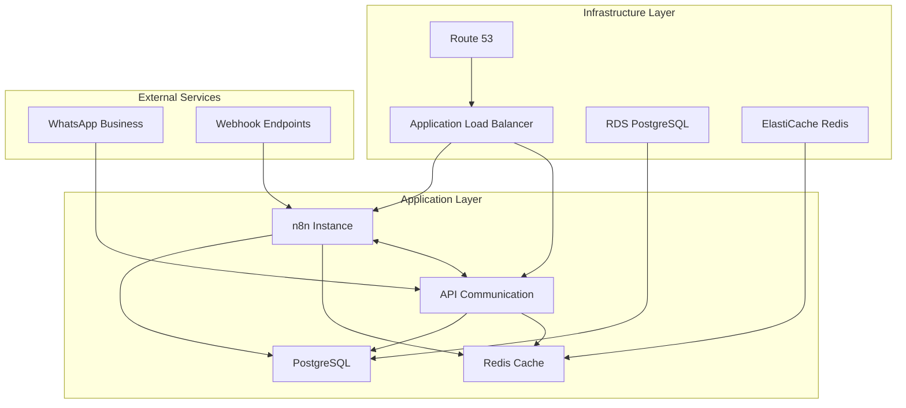

# n8n + Evolution API Deployment

This project provides infrastructure and deployment automation for **n8n** (workflow automation) and **Evolution API** (WhatsApp integration) using Docker and AWS CDK.

## 🏗️ Architecture Overview

The deployment consists of two main services that work together:

- **n8n**: Workflow automation platform with UI for creating WhatsApp integrations
- **Evolution API**: WhatsApp Business API integration service
- **PostgreSQL**: Shared database for both services
- **Redis**: Cache and queue management for n8n

Both services can communicate with each other through their APIs, allowing you to create powerful WhatsApp automation workflows entirely through the n8n visual interface.



## 🚀 Quick Start

### Local Development

1. **Clone and setup**:

   ```bash
   git clone <repository-url>
   cd n8n-whatsapp-integration
   cp .env.example .env
   # Edit .env with your desired configuration
   ```

2. **Start services**:

   ```bash
   npm run compose:up
   ```

3. **Access the services**:
   - n8n: http://localhost:5678 (admin/admin)
   - Evolution API: http://localhost:8080

### Production Deployment

1. **Configure GitHub Secrets**:

   ```
   AWS_ACCESS_KEY_ID
   AWS_SECRET_ACCESS_KEY
   AWS_ACCOUNT_ID
   PRODUCTION_DOMAIN_NAME
   PRODUCTION_CERTIFICATE_ARN
   ```

2. **Deploy by pushing to branches**:
   - `dev` → Development environment
   - `main`/`production` → Production environment

## 📋 Services Overview

### n8n (Workflow Automation)

- **Port**: 5678
- **Purpose**: Visual workflow builder for automation
- **Database**: PostgreSQL (shared)
- **Cache**: Redis for queue management
- **Authentication**: Basic auth (configurable)

### Evolution API (WhatsApp Integration)

- **Port**: 8080
- **Purpose**: WhatsApp Business API interface
- **Database**: PostgreSQL (separate schema)
- **Cache**: Redis for session management
- **Features**: QR code generation, message handling, webhook support

## 🔧 Configuration

### Environment Variables

Key configuration options in `.env`:

```bash
# Database Configuration
POSTGRES_USER=n8n
POSTGRES_PASSWORD=your_secure_password
POSTGRES_DB=n8n

# n8n Configuration
N8N_BASIC_AUTH_USER=admin
N8N_BASIC_AUTH_PASSWORD=your_password
N8N_ENCRYPTION_KEY=your_32_char_key

# Evolution API Configuration
EVOLUTION_API_KEY=your_api_key
EVOLUTION_WEBHOOK_URL=http://n8n:5678/webhook

# AWS Configuration (for deployment)
AWS_REGION=us-east-1
AWS_ACCOUNT_ID=your_account_id
DOMAIN_NAME=your-domain.com
```

## 🔄 Integration Workflow

### Setting up WhatsApp Integration in n8n

1. **Start Evolution API instance**:

   - Access Evolution API at http://localhost:8080
   - Create a new WhatsApp instance
   - Scan QR code to connect your WhatsApp account

2. **Configure n8n workflow**:

   - Create a new workflow in n8n
   - Add HTTP Request nodes to communicate with Evolution API
   - Use Evolution API endpoints for sending/receiving messages
   - Set up webhooks to receive WhatsApp events

3. **Example workflow nodes**:
   - **Webhook**: Receive WhatsApp messages
   - **HTTP Request**: Send messages via Evolution API
   - **Code**: Process message content
   - **Conditional logic**: Handle different message types

### Common Evolution API Endpoints

- `GET /instance/fetchInstances` - List all instances
- `POST /instance/create` - Create new instance
- `POST /message/sendText` - Send text message
- `POST /message/sendMedia` - Send media files
- `GET /chat/findChats` - Get chat list

## 🚀 Deployment Environments

### Development (`dev` branch)

- Single AZ deployment
- Minimal resources
- HTTP only
- Development database settings

### Production (`main` branch)

- Full multi-AZ deployment
- High availability
- HTTPS with custom domain
- Automated backups
- Performance monitoring

## 📁 Project Structure

```
n8n-whatsapp-integration/
├── .env.example              # Environment variables template
├── docker-compose.yml        # Local development setup
├── package.json             # Project dependencies and scripts
├── cdk.json                 # CDK configuration
├── tsconfig.json            # TypeScript configuration
├── jest.config.js           # Jest testing configuration
├── bin/
│   └── app.ts               # CDK app entry point
├── lib/
│   └── n8n-whatsapp-stack.ts # Main infrastructure stack
├── test/
│   └── n8n-whatsapp-stack.test.ts # Stack unit tests
└── .github/
    └── workflows/           # CI/CD pipeline definitions
        ├── deploy-dev.yml
        └── deploy-production.yml
```

## 🔒 Security Features

- **Network Isolation**: Services run in private VPC subnets
- **Database Security**: RDS with encryption at rest
- **API Security**: Evolution API with API key authentication
- **HTTPS**: SSL/TLS termination at load balancer
- **Secrets Management**: AWS Secrets Manager for sensitive data

## 📊 Monitoring and Logs

- **CloudWatch Logs**: Centralized logging for all services
- **Container Insights**: ECS monitoring and metrics
- **Health Checks**: Automated health monitoring
- **Alerts**: CloudWatch alarms for critical metrics

## 🛠️ Development Commands

```bash
# Local development
npm run compose:up          # Start all services
npm run compose:down        # Stop all services
npm run compose:logs        # View logs

# CDK commands
npm run cdk:synth          # Generate CloudFormation
npm run cdk:deploy         # Deploy to AWS
npm run cdk:destroy        # Remove AWS resources
```

## 🔍 Troubleshooting

### Common Issues

1. **n8n connection failed**:

   - Check database connectivity
   - Verify environment variables
   - Check service logs: `docker-compose logs n8n`

2. **Evolution API not connecting to WhatsApp**:

   - Regenerate QR code
   - Check webhook URL configuration
   - Verify API key setup

3. **Database connection errors**:
   - Ensure PostgreSQL is running
   - Check credentials in .env file
   - Verify network connectivity between services

### Log Access

```bash
# View specific service logs
docker-compose logs -f n8n
docker-compose logs -f evolution-api
docker-compose logs -f postgres

# View all logs
docker-compose logs -f
```

## 📝 API Documentation

### Evolution API Integration

For detailed Evolution API documentation, visit:
https://doc.evolution-api.com/

### n8n Webhook Configuration

To set up webhooks in n8n for receiving WhatsApp messages:

1. Create a webhook node in your workflow
2. Copy the webhook URL
3. Configure Evolution API to send events to this URL
4. Set up message processing logic in n8n

## 🤝 Contributing

1. Fork the repository
2. Create a feature branch
3. Make your changes
4. Test locally with `docker-compose up`
5. Submit a pull request

## 📄 License

This project is licensed under the MIT License - see the LICENSE file for details.

## 🆘 Support

For issues and questions:

1. Check the troubleshooting section above
2. Review Docker and CDK logs
3. Consult n8n and Evolution API documentation
4. Open an issue in this repository

---

**Note**: This deployment focuses on infrastructure and connectivity. The actual WhatsApp integration logic is built using n8n's visual workflow interface, connecting to Evolution API through HTTP requests.
